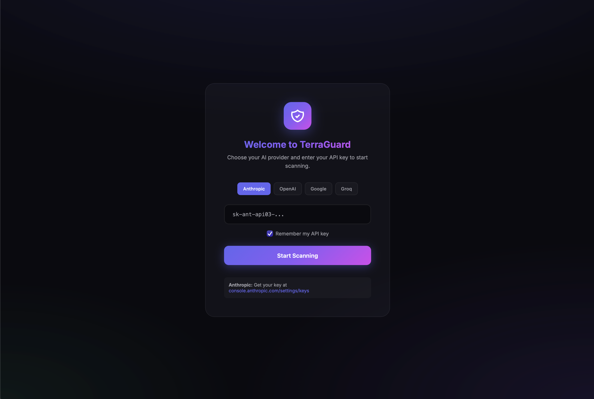
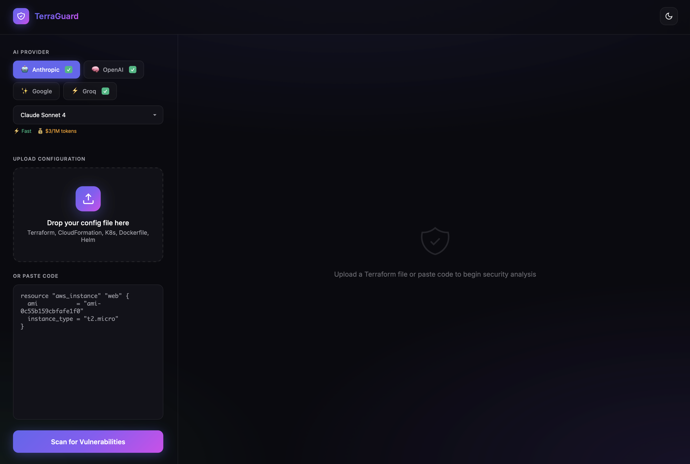

# TerraGuard - Infrastructure Security Scanner

AI-powered security review for infrastructure-as-code configurations.




## Supported Formats

- **Terraform** (.tf, .tf.json)
- **CloudFormation** (.yaml, .yml, .json, .template)
- **Kubernetes** (.yaml, .yml)
- **Dockerfile**
- **Helm Charts** (.yaml, .tpl)

## Features

- **Multi-Provider AI** - Choose from Anthropic, OpenAI, Google, or Groq
- **Secrets Detection** - Finds hardcoded passwords, API keys, tokens
- **Security Analysis** - Open ports, missing encryption, IAM issues
- **Cost Estimation** - AWS resource cost breakdown (Terraform/CloudFormation)
- **PDF Reports** - Export detailed security reports
- **Modern UI** - Dark/light themes with glassmorphism design

## Supported AI Providers & Models

| Provider | Model | Speed | Cost |
|----------|-------|-------|------|
| **Anthropic** | Claude Sonnet 4 | Fast | $3/1M tokens |
| | Claude 3.5 Haiku | Very Fast | $0.25/1M tokens |
| **OpenAI** | GPT-4o | Fast | $2.50/1M tokens |
| | GPT-4o Mini | Very Fast | $0.15/1M tokens |
| **Google** | Gemini 1.5 Pro | Fast | $1.25/1M tokens |
| | Gemini 1.5 Flash | Very Fast | $0.075/1M tokens |
| **Groq** | Llama 3.3 70B | Blazing Fast | Free tier! |
| | Llama 3.1 8B | Ultra Fast | Free tier! |

## Quick Start

### 1. Clone & Setup

```bash
git clone https://github.com/YourUsername/terraguard.git
cd terraguard
python -m venv venv
source venv/bin/activate  # On Windows: venv\Scripts\activate
pip install -r requirements.txt
```

### 2. Configure API Key (Choose One)

**Option A: Environment Variable (Recommended for personal use)**
```bash
cp .env.example .env
# Edit .env and add your API key(s):
# ANTHROPIC_API_KEY=sk-ant-api03-...
# OPENAI_API_KEY=sk-...
# GOOGLE_API_KEY=AIza...
# GROQ_API_KEY=gsk_...
```

**Option B: Enter in Browser (Recommended for sharing)**
- Skip the .env setup
- When you open the app, choose your AI provider and enter your API key
- Optionally save it in your browser's local storage

**Get API Keys:**
- Anthropic: https://console.anthropic.com/settings/keys
- OpenAI: https://platform.openai.com/api-keys
- Google: https://aistudio.google.com/app/apikey
- Groq: https://console.groq.com/keys (Free tier available!)

### 3. Run Backend

```bash
cd backend
uvicorn main:app --reload --port 8000
```

### 4. Run Frontend

```bash
cd frontend
python -m http.server 3000
```

Open http://localhost:3000

## API Usage

All endpoints accept optional headers:
- `X-API-Key` - Your API key (not required if env var is set)
- `X-Provider` - AI provider: `anthropic`, `openai`, `google`, or `groq` (default: `anthropic`)
- `X-Model` - Model to use (optional, uses provider's default)

### POST /review
Upload a config file for security review.

```bash
# Using Anthropic (default)
curl -X POST "http://localhost:8000/review" -F "file=@main.tf"

# Using OpenAI GPT-4o
curl -X POST "http://localhost:8000/review" \
  -H "X-API-Key: sk-..." \
  -H "X-Provider: openai" \
  -H "X-Model: gpt-4o" \
  -F "file=@main.tf"

# Using Groq (free!)
curl -X POST "http://localhost:8000/review" \
  -H "X-API-Key: gsk_..." \
  -H "X-Provider: groq" \
  -F "file=@main.tf"
```

### POST /review/pdf
Generate a PDF report.

```bash
curl -X POST "http://localhost:8000/review/pdf" \
  -H "X-Provider: anthropic" \
  -F "file=@main.tf" -o report.pdf
```

## What It Detects

| Format | Security Checks |
|--------|-----------------|
| Terraform | Open security groups, public S3, missing encryption, IAM issues |
| CloudFormation | Same as Terraform + DeletionPolicy, Parameter validation |
| Kubernetes | Privileged containers, root user, missing limits, hostNetwork |
| Dockerfile | Root user, latest tags, hardcoded secrets, unnecessary packages |
| Helm | Hardcoded values, missing defaults, template security |

## Tech Stack

- **Backend**: FastAPI + Python
- **Frontend**: Vanilla HTML/CSS/JS
- **AI**: Anthropic, OpenAI, Google, Groq (multi-provider)

## License

MIT
